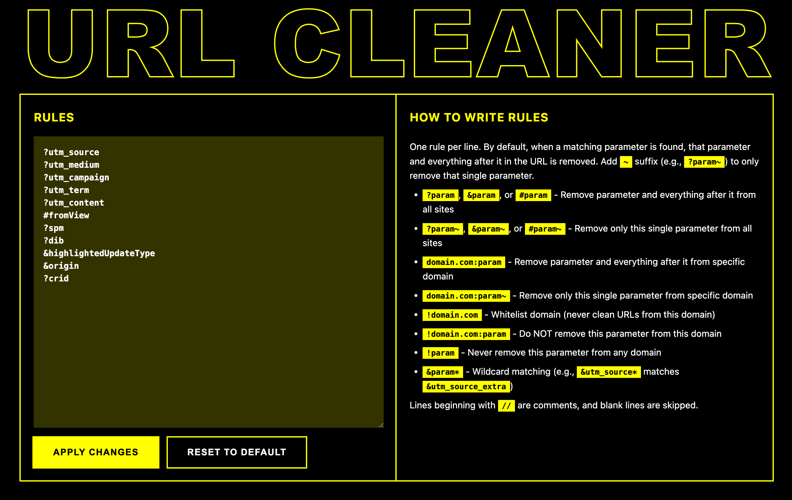

# URL Cleaner

Chrome extension that automatically removes tracking parameters from URLs during navigation and when copying links. 

Unlike many other URL cleaners, this one is highly customizable—just write rules with simple syntax in a text area. No navigating through multiple pages or clicking lots of buttons.

## ⚠️ THIS IS VIBE CODED ⚠️
So it might be a bit broken. But hey, it works better than the URL cleaners I’ve tried! This is my daily driver now.

## How It Works

- **Navigation cleaning**: Intercepts all main-frame navigations and removes matching parameters before the page loads
- **Clipboard cleaning**: Overrides clipboard write operations (`navigator.clipboard`, `document.execCommand('copy')`) to clean URLs before they're copied
- **Rule-based**: Uses a customizable list of parameter patterns to match against URLs

## Usage

1. Click the extension icon to open the options page
2. Add rules in the text area (one per line)
3. Click "Apply changes"

Syntax explained in the html.

Rules sync across devices when signed into Chrome. (Probably. Have not tested it. Uses `chrome.storage.sync`.)

## Default Parameters

Defaults appear in the textarea together with user parameters. Edit `DEFAULT_PARAMS` in `background.js` (lines 2-13) to change them.

## Installation

1. Clone this repository
2. Open Chrome and go to `chrome://extensions/`
3. Enable "Developer mode"
4. Click "Load unpacked" and select this directory